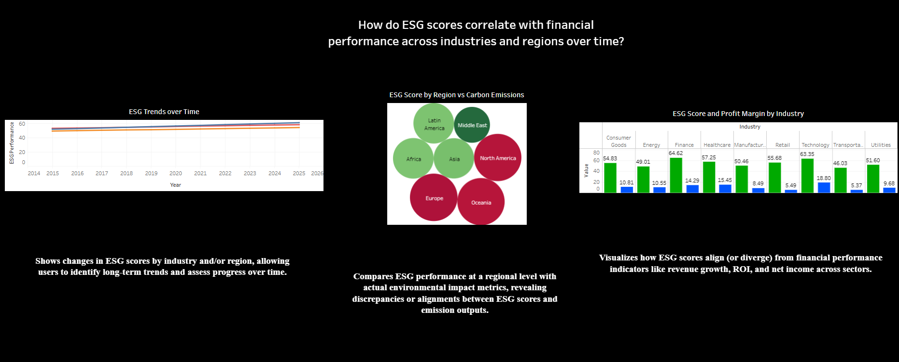

# ESG vs Financial Dashboard (Tableau)

## Overview
This Tableau dashboard explores how ESG (Environmental, Social, and Governance) scores correlate with financial performance across industries and regions over time. The dashboard provides interactive visualizations covering ESG vs. financial metrics by industry, ESG score trends over time, and ESG scores by region compared to carbon emissions.

View the dashboard live here: [Tableau Public Link](https://public.tableau.com/app/profile/james.mosher/viz/esg_financials/esg)

---

## Data Sources

All data used for Tableau visualizations was generated from PostgreSQL queries in pgAdmin.

esg_q1.csv: ESG Scores vs. Financial Metrics by Industry

esg_q2.csv: ESG Trends by Year and Region

esg_q3.csv: ESG Scores and Carbon Emissions by Region

---

## Key Insights

### 1. ESG Scores vs. Financial Metrics by Industry
- Visualizes how ESG scores align (or diverge) from financial performance indicators like revenue growth, ROI, and net income across sectors.

---

### 2. ESG Trends by Year and Region
- Shows changes in ESG scores by industry and/or region, allowing users to identify long-term trends and assess progress over time.

---

### 3. ESG Scores and Carbon Emissions by Region
- Compares ESG performance at a regional level with actual environmental impact metrics, revealing discrepancies or alignments between ESG scores and emission outputs.

---

## Tools/Sites Used
- Kaggle
- Excel
- pgAdmin
- Tableau Public

---

## Screenshot

---

## Insights & Observations

- High ESG scores don't always guarantee financial outperformance, but some industries (e.g., tech and healthcare) show a strong positive relationship.

- ESG scores have generally improved in developed regions, while emerging markets show inconsistent progress.

- Some regions with high ESG ratings still show elevated carbon emissions, indicating potential greenwashing or data misalignment.

---

## Additional Notes

This was my second attempt at a Tableau dashboard, and my 3rd dashboard overall. 

---

## Author
Created by [James Mosher](https://www.linkedin.com/)

